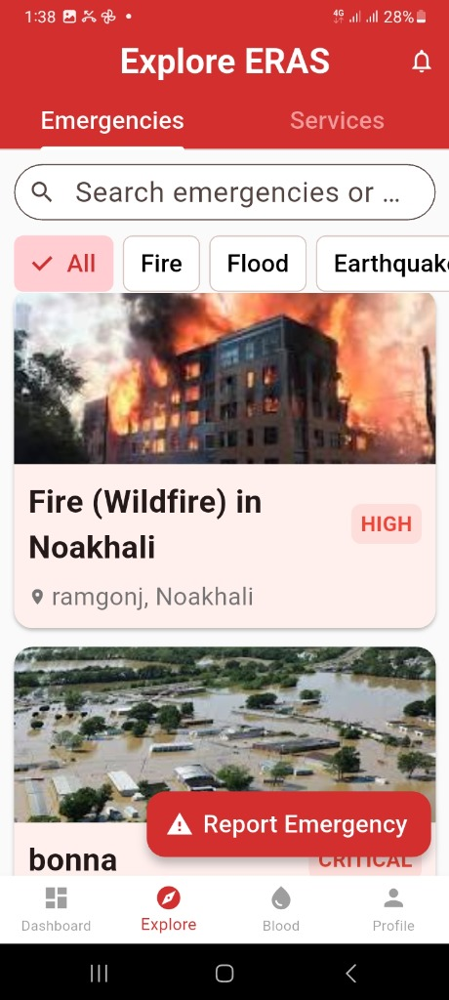

<div align="center">

# 🚨 ERAS Mobile
### Emergency Response & Alert System

[](https://flutter.dev)
[](https://dart.dev)
[](https://djangoproject.com)
[](https://python.org)
[](LICENSE)
[](https://github.com/ibrahim-hasan5/eras_mobile/releases/tag/v1.0.2)

**A full-stack mobile application connecting citizens during disasters and emergencies.**

[📲 Download APK](https://github.com/ibrahim-hasan5/eras_mobile/releases/tag/v1.0.2) · [🐛 Report Bug](https://github.com/ibrahim-hasan5/eras_mobile/issues) · [✨ Request Feature](https://github.com/ibrahim-hasan5/eras_mobile/issues)

</div>

---

## 📸 Screenshots

<div align="center">
  
</div>

---

## 📖 About The Project

**ERAS Mobile** is a cross-platform emergency response application built with **Flutter** on the frontend and **Django REST Framework** on the backend. The app empowers citizens to report disasters in real-time, request blood donations, receive emergency alerts, and connect with local service providers — all in one unified platform.

The backend API is deployed at: `https://eras-1.onrender.com`

---

## ✨ Features

| Feature | Description |
|---|---|
| 🔐 **Authentication** | Secure token-based login & registration |
| 🚨 **Disaster Reporting** | Report emergencies with photo evidence & location |
| 📍 **Explore Emergencies** | Browse & filter active disasters by category (Fire, Flood, Earthquake) |
| 🔔 **Real-time Alerts** | Receive & manage emergency alerts |
| 🩸 **Blood Network** | Search donors, create & respond to blood requests |
| 🏥 **Service Providers** | Discover and rate local emergency service providers |
| 👤 **Dual Dashboard** | Separate dashboards for Citizens & Service Providers |
| 🌐 **Bilingual Support** | Multi-language support via Flutter Localizations |
| 🖼️ **Image Upload** | Upload disaster photos directly from camera or gallery |

---

## 🛠️ Tech Stack

### 📱 Frontend (Mobile)

| Technology | Purpose |
|---|---|
| **Flutter (Dart)** | Cross-platform mobile UI framework |
| **Material Design 3** | UI component library |
| **HTTP** | RESTful API communication |
| **Shared Preferences** | Local token storage & session persistence |
| **Image Picker** | Camera & gallery image selection |
| **Flutter Localizations** | Multi-language / i18n support |
| **intl** | Date & number formatting |

### 🖥️ Backend

| Technology | Purpose |
|---|---|
| **Django (Python)** | Core web framework & business logic |
| **Django REST Framework** | RESTful API design |
| **Token Authentication** | Secure stateless API access |
| **Django ORM** | Database abstraction & management |
| **Multipart File Upload** | Disaster image handling |

---

## 🏗️ Project Architecture

```
eras_mobile/
├── lib/
│   ├── main.dart                    # App entry point & auth check
│   ├── models/                      # Data models
│   │   ├── user.dart
│   │   ├── disaster.dart
│   │   ├── blood_request.dart
│   │   ├── disaster_alert.dart
│   │   ├── disaster_response.dart
│   │   ├── disaster_update.dart
│   │   ├── citizen_profile.dart
│   │   └── service_provider_profile.dart
│   ├── screens/                     # UI screens
│   │   ├── login_screen.dart
│   │   ├── register_screen.dart
│   │   ├── home_screen.dart
│   │   ├── main_screen.dart
│   │   ├── explore_screen.dart
│   │   ├── disaster_detail_screen.dart
│   │   ├── report_disaster_screen.dart
│   │   ├── alerts_screen.dart
│   │   ├── blood_network_screen.dart
│   │   ├── create_blood_request_screen.dart
│   │   ├── citizen_dashboard_screen.dart
│   │   ├── provider_dashboard_screen.dart
│   │   ├── provider_detail_screen.dart
│   │   ├── profile_screen.dart
│   │   ├── edit_profile_screen.dart
│   │   └── add_response_screen.dart
│   ├── services/                    # Business logic & API layer
│   │   ├── api_service.dart         # Centralized HTTP client
│   │   └── language_manager.dart   # i18n manager
│   └── widgets/                     # Reusable UI components
├── screenshots/                     # App screenshots
└── pubspec.yaml                     # Dependencies
```

---

## 🚀 Getting Started

### Prerequisites

- [Flutter SDK](https://docs.flutter.dev/get-started/install) `^3.11.0`
- [Dart SDK](https://dart.dev/get-dart) `^3.11.0`
- Android Studio / VS Code with Flutter extension

### Installation

1. **Clone the repository**
   ```bash
   git clone https://github.com/ibrahim-hasan5/eras_mobile.git
   cd eras_mobile
   ```

2. **Install dependencies**
   ```bash
   flutter pub get
   ```

3. **Run the app**
   ```bash
   flutter run
   ```

> ⚠️ **Note:** The app connects to a live Django backend hosted at `https://eras-1.onrender.com`. No additional backend setup is required to run the mobile app.

---

## 📲 Download

Get the latest APK directly:

**[⬇️ Download ERAS Mobile v1.0.2](https://github.com/ibrahim-hasan5/eras_mobile/releases/tag/v1.0.2)**

---

## 🔌 API Endpoints

The app communicates with the Django backend via the following REST endpoints:

| Method | Endpoint | Description |
|--------|----------|-------------|
| `POST` | `/accounts/api/login/` | User login |
| `POST` | `/accounts/api/register/` | User registration |
| `GET` | `/accounts/api/dashboard/` | User dashboard data |
| `GET/PUT` | `/accounts/api/profile/` | View & update profile |
| `GET` | `/disasters/api/disasters/` | List all disasters |
| `POST` | `/disasters/api/disasters/` | Report a disaster |
| `GET` | `/disasters/api/alerts/` | Get emergency alerts |
| `POST` | `/disasters/api/alerts/{id}/mark_read/` | Mark alert as read |
| `GET/POST` | `/disasters/api/responses/` | Disaster responses |
| `GET` | `/accounts/api/blood-requests/` | List blood requests |
| `POST` | `/accounts/api/blood-requests/` | Create blood request |
| `GET` | `/accounts/api/donors/search/` | Search blood donors |
| `GET` | `/accounts/api/providers/` | List service providers |
| `POST` | `/accounts/api/providers/{id}/rate/` | Rate a provider |

---

## 👨‍💻 Author

**Ibrahim Hasan**

[](https://github.com/ibrahim-hasan5)

---

## 📄 License

This project is licensed under the MIT License. See the [LICENSE](LICENSE) file for details.

---

<div align="center">
  Made with ❤️ using Flutter & Django
</div>
